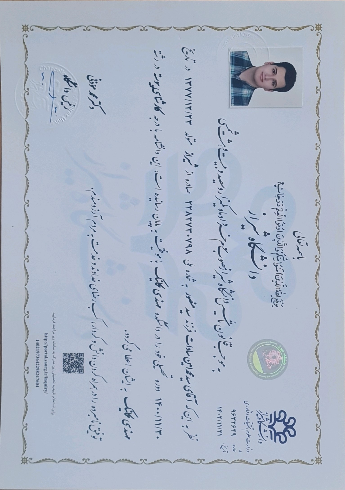
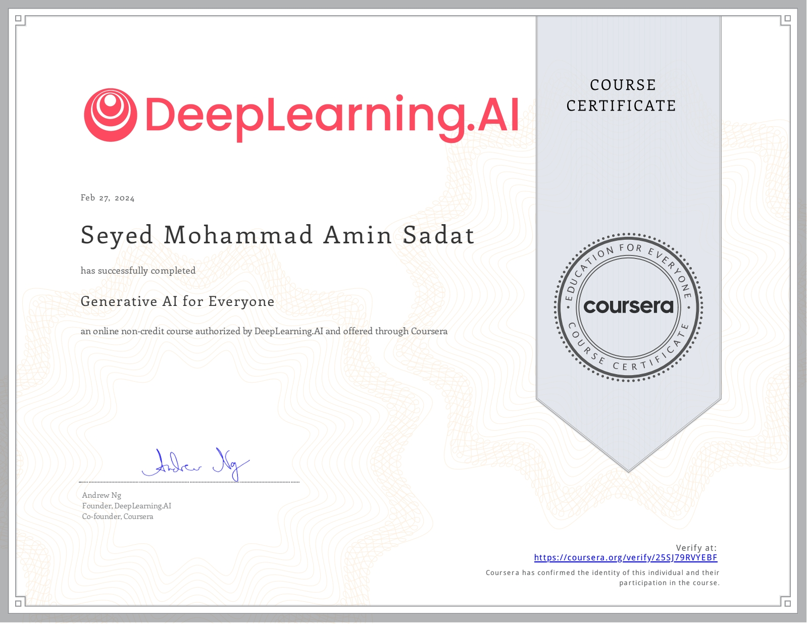
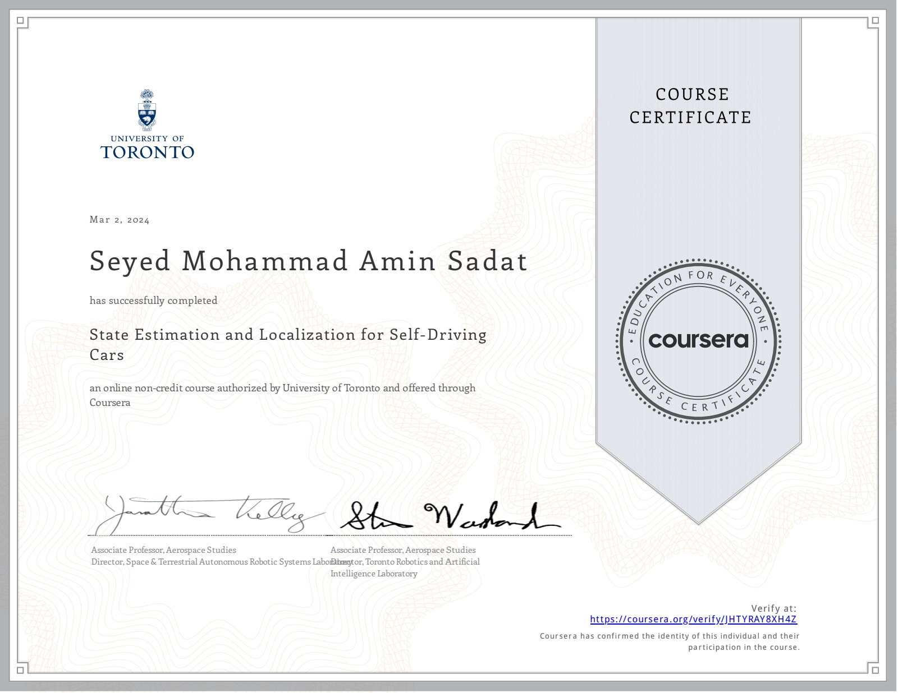
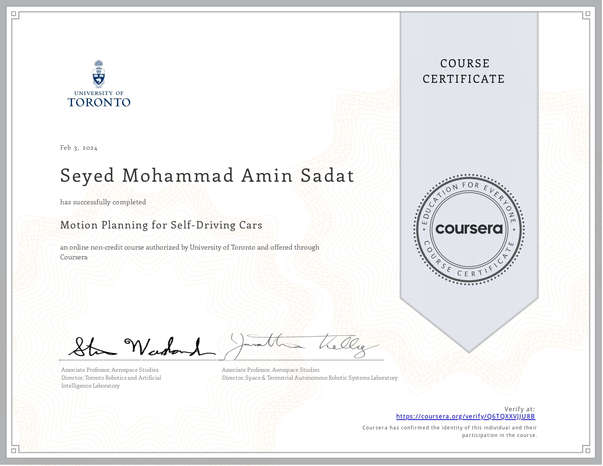

# This is an overview of my certifications

## Educational

<button type="button" onclick="location.href='education/bsc_cer/'">

Title: Bachelor's degree 
Location: Shiraz University 

</button>

## Online

<button type="button" onclick="location.href='online/genai_coursera'">

Title: Generative AI for Everyone 
Organization: Coursera - DeepLearning.AI 
<a href="https://coursera.org/share/01490df08119f375dd03b0ca3970003c" target="_blank"> Credential ID</a>

</button>

##### Self-Driving Cars Specialization

<button type="button" onclick="location.href='online/es_loc_coursera/'">

Title: State Estimation and Localization for Self_Driving cars 
Organization: Coursera - University of Toronto 
Course 2 of 4 in the specialization 
<a href="https://coursera.org/share/8960e9fa5a45690776cdbcad6a56b841"> Credential ID</a>

</button>

<button type="button" onclick="location.href='online/mp_coursera/'">

Title: Motion Planing for Self-Driving Cars 
Organization: Coursera - University of Toronto 
Course 4 of 4 in the specialization 
<a href="https://coursera.org/share/fae0716e86fb2613b04dafcc26a9711d "> Credential ID</a>

</button>
<!-- mp -->

## other
