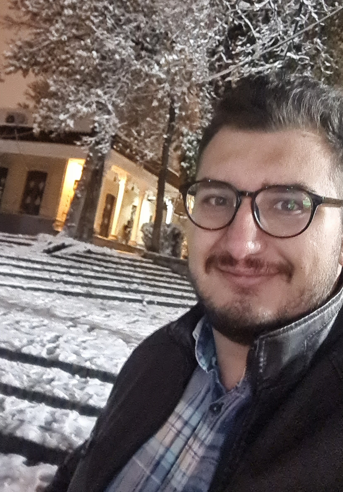

# 
 Welcome to my Page 

!!! quotes ""

    Strive for perfection in everything you do. Take the best that exist and make it better. When it does not exist, design it.
<i> -Sir Henry Royce  </i>

I am a mechatronics engineer with MSc degree. I'm passionate about technology, robots and self-driving cars. This website is space for me to share my thoughts, projects, and experience. I enjoy playing electric guitar and listening for rock and metal music 🤘🏻. I'm also passionate about karate🥋 ,holding a 3rd dan black belt with coaching and referee certifications.

## Somethings you can find on this Website

- [Blog posts](Blog/index.md)
- [Publications](Publications/pub.md)
- [Certifications](certifications/cer.md)
- [Code documentation](documentations/doc.md)

## Here is a quick link to my personal pages

[:simple-github: @reza0314](https://github.com/reza0314)

[:simple-linkedin: Mohammad Amin Sadat](https://www.linkedin.com/in/mohammad-amin-sadat-341552196/)

[:simple-x: @Reza0314S](https://x.com/Reza0314S?t=FAXcUkL-I--4VqYAJCJoww&s=09)

[:simple-threads: @mohammad.amin.sadat](https://www.threads.net/@mohammad.amin.sadat)

[:material-gmail: s.mohammad.amin.sadat@gmail.com](mailto:s.mohammad.amin.sadat@gmail.com)

This website is made with the best libraries [MkDocs](https://www.mkdocs.org/) and [material theme](https://www.starfallprojects.co.uk/projects/).

